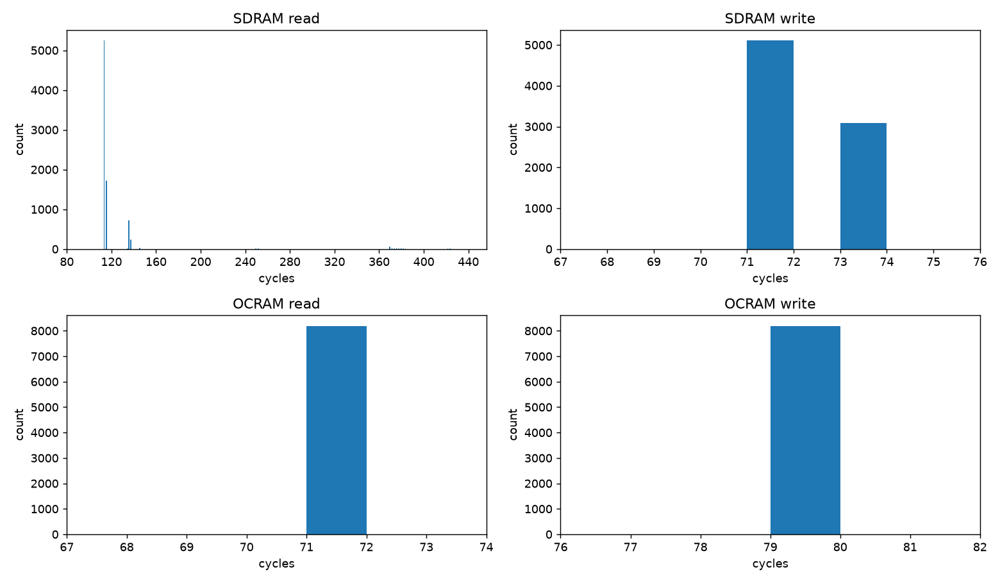
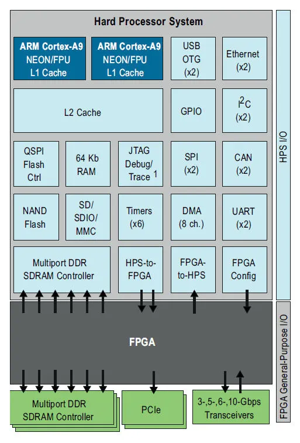

# Bootable A9 RTOS from Scratch

The ARM Cortex-A9 is a relatively common microprocessor and shows up a lot as the integrated processor on smaller/older FPGA SOC's (think lower end Zynq boards, Cyclone V, etc). It's cheap, does microprocessor things reasonably well, has lots of support for interfacing with FPGA's as you'd expect, and tends to come in a nicely square-shaped package. It was also used in really old smartphones back in the day (the iPhone 4s A5 chip used two A9 cores, similar to the Cyclone V). The A9 was never designed to do real-time work though, which is ironic given its prevalence in FPGA SOC's. If one wants to do real-time work on the A9 they basically have three main solutions that can run (mostly) out of the box: 

1. Embedded Linux - Not actually real-time and very bloated depending on what is needed
2. FreeRTOS - Much leaner but not good for high utilization tasks and does not natively support SMP
3. Zephyr - Leaner than Linux and more capable than FreeRTOS but still somewhat bloated

It would be nice to have a very lightweight and efficient real-time scheduler. I do a lot of control and DSP stuff so EDF is a good starting point here for me because 1: it's very good for dealing with hard periodic constraints and 2: It's relatively underserved: Embedded Linux is completely inappropriate for it, FreeRTOS doesn't natively support it, and Zephyr only uses it as a tiebreaking mechanism, not as the fundamental scheduling primitive. I'd also like SMP if at all possible as all the A9-based systems I've worked with have been dual-core. Lastly, I'd like to make whatever gets built bootable such that it can be loaded onto an SD card. For now we'll ignore the FPGA stuff and assume that gets handled separately; in the future I'd like to pack the FPGA image into the SD card slot and mount it as part of the boot process but that can wait. At the same time as all this, I'd like to answer the following question: just how inappropriate is the A9 for actual real-time work? I think it's fun to try and make hardware do stuff it isn't designed to do, and I've been asked this question multiple times before to which I gave the standard safe answer of "A9 isn't designed for this so we should keep all real-time functionality on the FPGA irrespective of how fast it actually needs to run". I still think this was probably the right answer, further reinforced by the fact that we had to run Linux on the A9 in this particular situation anyway. A more conclusive answer would still be appreciated though so attempting to get it seems reasonable enough.

This project can obviously become very big very fast so an 80/20 on the core components is most likely the best use of time if not attempting to build a commercial-grade system (I don't want to maintain or sell this. I just want to see A9 do dual core EDF and pack the whole thing on an SD card).

With all that said here's the (actual) preamble.

## Preamble

We will build the thing for a Cyclone V (DE1-SOC) because that's what I currently own. Later on this may be extended to accomodate other systems as well but we'll only worry about this one for now. 

We will assume the following basic operational behaviour is expected:

1. Kernel + application code is loaded into SD card.
2. SD card goes in SD card slot.
3. The system boots from the SD card whenever it's power cycled after which it proceeds to run the application code. It's assumed the application code may make use of the kernel but it shouldn't be a requirement.
4. If a piece of hardware functionality is desired or not desired (caches, SMP etc), we pass these as compile parameters, we don't change them at runtime. 

Since we're running on a real chip we need to make sure all the hardware is initialized properly at the right times. Some of the hardware is A9-specific (GIC, L1 caches). Other stuff is Cyclone-V specific (L2 cache, SDRAM PHY). If you don't know what these are don't worry about it they will be discussed in more detail later on. The point is we need to separate the board-specific functionality so that we can port to other systems more easily in the future. This is the point of something like a board support package (BSP). Our BSP will be very minimal. It's only role will be to set up the standard Cyclone V hardware components that are shared by both cores and useful for generic system operation. The rest of the hardware initialization can be carried out by the kernel. 

## Types of Memory and Fused Kernel-Preloaders

All A9's have something called On-Chip RAM (OCRAM). It's exactly what you'd expect and is 64KB on the Cyclone V. A9's also have an interface for Synchronous Dynamic RAM (SDRAM). The SDRAM lives off-chip and its implementation is up to the SOC manufacturer because memory requirements may change with the intended application. Lastly, the A9 has a special piece of memory called Boot ROM. The purpose of Boot ROM is to read data from something like an SD card and copy it into OCRAM. Then something like a preloader runs from OCRAM, initializes the SDRAM hardware, and copies the rest of the code into the SD card. Normally the kernel would be separate from the preloader and live alongside the application code in SDRAM but there's no reason why this is strictly necessary. This means we could in theory keep small kernels in OCRAM such that the distinction between preloader and kernel effectively becomes meaningless. Since OCRAM is faster this could generally be seen as preferable, especially when extremely strict real-time requirements necessitate that caches not be used. It's also good for real-time performance, since SRAM access latency is far more deterministic than DRAM access latency, due to not having to interface with the DDR controller. We could also move application code into OCRAM as well if it's small enough though we do not necessarily expect that it is. 

This is all to say we can combine the kernel with what would normally be considered a preloader and run it in OCRAM to make it slightly faster especially when the caches are turned off. To put it into perspective, here's a speed comparison:




## A9 Hardware

As alluded to earlier, we are using a real A9 on a real SOC and so we have to worry about the physical hardware. Here's a picture:



Not pictured here is the Snoop Control Unit (SCU) which is used to manage cache coherence between both core's L1 caches and the MMU whcih is used for physical to virtual address translation and required for engaging the L1 data cache. 


## Boot Seqeuence

We will now do an overview of how the system boots. 

### Boot ROM to Reset Vector
All Boot ROM does is take a specific region of the SD card and move it into OCRAM, it then moves the PC to a specific address and reads a header. In the case of the Cyclone V this address is ```0x40``` and the preloader requires ```0x0C``` bytes of space allocated to the header. We populate this zone when we build the SD card image so we have to make sure that not code or data lives there.

Once Boot ROM has run the header it moves the PC to the location specified in the header. We specify address 0X0 because that's where the reset vector in our vector table lives. From here we jump to ```_reset_handler``` in `startup.s`.


### _reset_handler
The first thing we do is set the Vector Based Address Register (VBAR) to our vector table's location. 

`ldr r0, =_vectors
mcr p15, 0, r0, c12, c0, 0`

Next we walk each stack and disable interrupts. We start the walk from a different place based on which core is running:

```
.if ENABLE_SMP != 0
    mrc p15, 0, r0, c0, c0, 5        @; MPIDR
    and r0, r0, #0x3                 @; core id
    cmp r0, #0
    ldrne r0, =_cpu1_und_stack_top   @; CPU1: its own stack bank
    ldreq r0, =_cpu0_und_stack_top   @; CPU0: top-of-OCRAM bank
.else
    ldr r0, =_cpu0_und_stack_top
.endif
    msr CPSR_c, #(MODE_UND | I_BIT | F_BIT)
    mov sp, r0
    ldr r1, =_und_stack_size
    sub r0, r0, r1

    msr CPSR_c, #(MODE_ABT | I_BIT | F_BIT)
    mov sp, r0
    ldr r1, =_abt_stack_size
    sub r0, r0, r1

    msr CPSR_c, #(MODE_FIQ | I_BIT | F_BIT)
    mov sp, r0
    ldr r1, =_stack_size
    sub r0, r0, r1

    msr CPSR_c, #(MODE_IRQ | I_BIT | F_BIT)
    mov sp, r0
    ldr r1, =_stack_size
    sub r0, r0, r1

    msr CPSR_c, #(MODE_SVC | I_BIT | F_BIT)
    mov sp, r0
    ldr r1, =_stack_size
    sub r0, r0, r1

    msr CPSR_c, #(MODE_SYS | I_BIT | F_BIT)
    mov sp, r0
```


Next we invalidate the L1 I-Cache, A9 requires we do this before we can initialize it but it's easy because all we have to do is write to a register:

```
    mov r1, #0
    DSB
    mcr p15, 0, r1, c7, c5, 0
    ISB
```

L1 D-Cache is harder because there's no bulk invalidate. It's 32KB and 4-way set associative with a cache line size of 32 bytes which means there are (32 * 1024) / 32 / 4 = 256 sets with 4 mappings per set i.e. there are 256 types of 32-byte line and each line can map to 1 of 4 different locations in the cache. We will invalidate each of the 256 different sets on a per-way basis: 

```
way_loop:
    mov r3, #0
set_loop:
    mov r2, r1, lsl #30
    orr r2, r2, r3, lsl #5
    mcr p15, 0, r2, c7, c6, 2
    add r3, r3, #1
    cmp r0, r3
    BGT set_loop

    add r1, r1, #1
    cmp r1, #4
    BNE way_loop
```


We then invalidate the TLB and enable BP and data prefetch. They're on by default right now but it would be easy to make them compile options in the future. 

```
@; INVALIDATE TLB
mcr p15, 0, r1, c8, c7, 0

@; BRANCH PREDICTION ENABLE
mov r1, #0
mrc p15, 0, r1, c1, c0, 0
orr r1, r1, #(0x1<<11)
mcr p15, 0, r1, c1, c0, 0

@; ENABLE D-SIDE PREFETCH
MRC p15, 0, r1, c1, c0, 1
ORR r1, r1, #(0x1 <<2)
MCR p15, 0, r1, c1, c0, 1
DSB
ISB
```

The first time all this code is run it's on CPU0 because Boot ROM uses CPU0 by default and CPU1 is in reset state upon power cycle thus we fail the following check and enter `_cpu0_fork`:

```
_cpu0_fork:
@; Zero BSS
    ldr r0, =_bss_start
    ldr r1, =_bss_end
    mov r2, #0
bss_zero:
    cmp r0, r1
    strlt r2, [r0], #4
    blt bss_zero

@; Zero the OCRAM host island (fault records, boot gate, SMP mailbox)
    ldr r0, =_host_shared_ocram_start
    ldr r1, =_host_shared_ocram_end
    mov r2, #0
host_ocram_zero:
    cmp r0, r1
    strlt r2, [r0], #4
    blt host_ocram_zero

@; RELEASE CPU1 -> it re-enters _reset_handler and forks on MPIDR
.if ENABLE_SMP != 0
 .if BOARD_IS_QEMU != 0
    nop
 .else
    ldr r0, =SYSMGR_ROMCODE_CPU1STARTADDR
    ldr r1, =_reset_handler
    str r1, [r0]                        @; cpu1startaddr = &_reset_handler (CPU1 re-enters, forks on MPIDR)

    ldr r0, =RSTMGR_MPUMODRST
    ldr r1, [r0]
    bic r1, r1, #RSTMGR_MPUMODRST_CPU1  @; deassert CPU1 reset -> CPU1 boots ROM -> _cpu1_spin
    str r1, [r0]
 .endif
.endif
```


At this point CPU1 is engaged, vectors to _reset_handler, executes all of the previous cache invalidation + BP + prefetch code and jumps to `_cpu1_fork`, wherein the code will be discussed shortly. 


After CPU0 turns on CPU1, it branches to cpu0_startup:

```
.if BOOT_TEST != 0
    bl ktrace_wait_boot
.endif
    bl cpu0_startup         @; RUN CP0 STARTUP AND SET MAILBOX
```


```C
void cpu0_startup(void)
{
#if ENABLE_SMP
    while (!g_cpu1_ready){}    /* wait for CPU1 in its spin loop before the remap below */
#endif

    bsp_sdram_init();               /* PLL/scan-mgr/SDRAM/NIC301 -- prime self-boot suspect */
    bsp_precache_init();
    build_tables();
    set_ttb_ptrs();
    cpu0_gic_init();
    cpu0_timer_start();

    pmu_init();
    heap_init();        // must precede psched_init(): it kMalloc's main_thread + the deque
    

#if ENABLE_SMP
    g_cpu_mailbox_uncached = 1;
    __asm__ volatile (
        "dsb\n\t"
        "sev\n\t"
    );

    while (g_cpu_mailbox_uncached != 2)
    {
        __asm__ volatile (
            "wfe\n\t"
        );
    }

    g_cpu_mailbox_uncached = 0;
#endif


    __asm__ volatile (
        "cpsie i\n\t"
    );

    psched_init();
}
```

`cpu0_startup` first initializes the SDRAM PHY (lots of code to do this and most of it came from [U-Boot](https://github.com/u-boot/u-boot)). To do this it needs to first start the Cyclone V PLL machinery, configure the IO ring used to physically interface with the PHY, provide inputs to the PHY's control interface, run the PHY's calibration sequence, specify the size of the memory region, and remap the system's memory so that adress 0x0 starts at the bottom of the SDRAM block instead of boot ROM. From here we can enable the SCU and L2 if desired, then build our page tables. We will assume direct mapping between our virtual and physical memory. The page table allows for up to two levels of granularity. We only care about using the finer level when we want to make specific sections uncacheable, mainly for storing system diagnostic information to be read over JTAG. We set TTB pointers so we know where the page tables are, initialize CPU0's GIC and timers, start the PMU (this will be important in our scheduling policy later on), initialize the heap, and wait for CPU1 to signal that it's ready for the scheduler to be engaged (scheduler needs both cores live during SMP).  


```
_cpu1_fork:
.if ENABLE_SMP != 0
    .align 2
    ldr r0, =g_cpu1_ready
    mov r1, #1
    str r1, [r0]                        @; publish: CPU1 is off the 0x0 alias, in OCRAM
    dsb
    ldr r0, =g_cpu_mailbox_uncached

    wfe
    1:  ldr r1, [r0]
        cmp r1, #0
        bne engage
        wfe
        b 1b

    engage:
        bl cpu1_startup
        cpsie i

        ldr r0, =g_cpu_mailbox_uncached
        mov r1, #2 
        str r1, [r0]  
        dsb 
        sev

        bl cpu1_main
.endif
```


In the above C code, CP0 first signals to CPU1 that it's ready for CPU1 to run its startup routine, which sets TTB pointers, GIC, timers, and PMU like in `cpu0_startup`. It then waits for the completion signal. To save power, the wait/signal mechanism makes use of the `wfe` and `sev` instructions in conjunction with a shared mailbox to avoid breakout on the wrong event. CP0 initializes the scheduler when CPU1 has finished its startup routine. At this time, CPU1 may or may not be in its mainloop. The mainloop is empty and it's expected that when CPU1 executes tasks it does so by way of the scheduler. CPU0's mainloop is expected to contain the relevant application code and may assign tasks to CPU1 as needed. Any task running on CPU1 can also assign more tasks to the processor if desired. 
